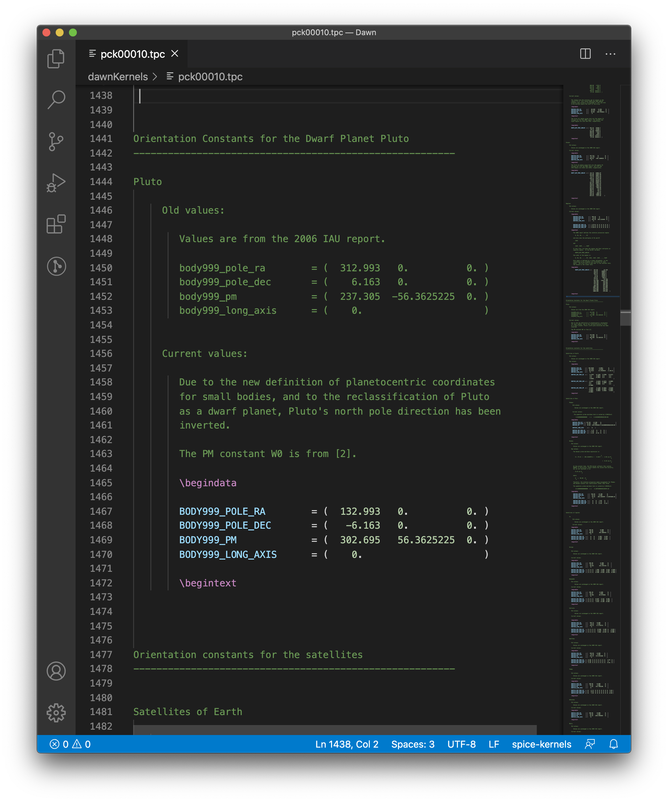

# spice-kernels README

This extension provides basic syntax highlighting for spice text kernels.

## Features

Syntax coloring helps distinguish between documentation and data. Without syntax highlighting, it would
be difficult to distinguish between the old data and the actual data in the example below:

## Known Issues

If for some reason a file has a begindata with no matching begintext, that
syntax will not be colored. That is, however, quite uncommon.

## Release Notes

### 1.0.0

Initial release of spice-kernels
